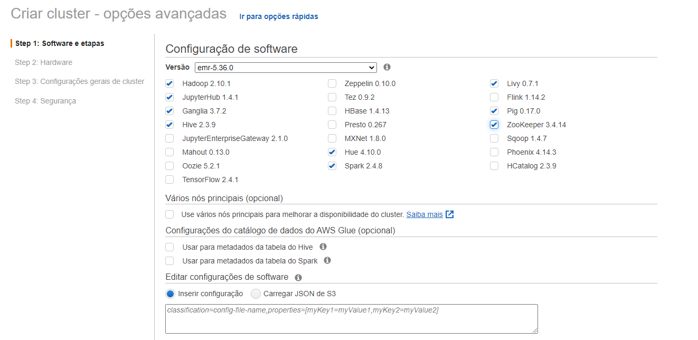
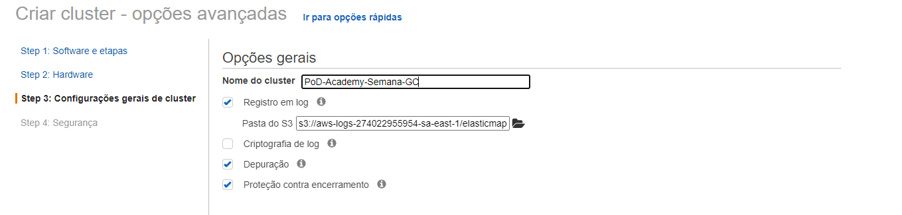
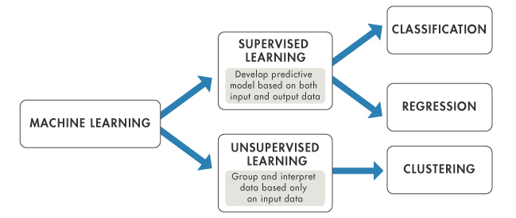

<!-- Improved compatibility of back to top link: See: https://github.com/othneildrew/Best-README-Template/pull/73 -->

<!--
*** Thanks for checking out the Best-README-Template. If you have a suggestion
*** that would make this better, please fork the repo and create a pull request
*** or simply open an issue with the tag "enhancement".
*** Don't forget to give the project a star!
*** Thanks again! Now go create something AMAZING! :D
-->

<!-- Logo da PoD Academy -->
 

  

  <h3 align="center">Semana da Ciência de Dados</h3>

  

    Resolvendo problemas de negócio utilizando Análise de Dados, Ciência de Dados e Tecnologia!
     
    <a href="#"><strong>PoD Academy »</strong></a>
     
  

<!-- Sumário -->

  
Sumário

  <ol>
    <li>
      <a href="#semana-game-changer">Semana da Ciência de Dados</a>
    </li>
    <li>
      <a href="#introdução-ao-mundo-big-data-e-analytics">Introdução ao mundo Big Data e Analytics</a>
      <ul>
        <li><a href="#conceitos-sobre-big-data">Conceitos sobre Big Data</a></li>
        <li><a href="#pessoas-e-empresas-data-driven">Pessoas e empresas Data-Driven</a></li>
        <li><a href="#engenharia-de-dados">Engenharia de Dados</a></li>
        <li><a href="#ciência-de-dados">Ciência de Dados</a></li>
        <li><a href="#problemas-de-negócios-em-diversos-segmentos">Problemas de Negócios em diversos segmentos</a></li>
        <li><a href="#carreiras-na-área-de-dados-e-analytics">Carreiras na área de Dados e Analytics</a></li>
      </ul>
    </li>    
    <li>
      <a href="#cloud-computing">Cloud Computing</a>
      <ul>
        <li><a href="#introdução-ao-conceito-de-computação-em-nuven">Introdução ao conceito de computação em nuven</a></li>
        <li><a href="#arquitetura-para-engenharia-de-dados">Arquitetura para Engenharia de Dados</a></li>
        <li><a href="#arquitetura-para-ciência-de-dados">Arquitetura para Ciência de Dados</a></li>
        <li><a href="#configuração-de-cluster-para-ambiente-de-trabalho">Configuração de Cluster para ambiente de trabalho (DS & DE)</a></li>
      </ul>    
    </li>
    <li>
      <a href="#engenharia-de-dados">Engenharia de Dados</a>
      <ul>
        <li><a href="#o-que-são-dados-e-quais-tipos">O que são dados e quais tipos</a></li>
        <li><a href="#fontes-de-dados">Fontes de Dados</a></li>
        <li><a href="#conceito-de-etl">Conceito de ETL</a></li>
        <li><a href="#arquitetura-de-dados">Arquitetura de Dados</a></li>
        <li><a href="#features-para-machine-learning">Features para Machine Learning</a></li>
        <li><a href="#feature-store">Feature Store</a></li>
      </ul>    
    </li>
    <li>
      <a href="#ciência-de-dados">Ciência de Dados</a>
      <ul>
        <li><a href="#framework-crisp-dm">Framework CRISP-DM</a></li>
        <li><a href="#conceito-de-metadados">Conceito de Metadados</a></li>
        <li><a href="#preparação-de-dados">Preparação de Dados</a></li>
        <li><a href="#seleção-de-variáveis">Seleção de Variáveis</a></li>
        <li><a href="#treinamento-de-algorítmos-de-classificação">Treinamento de Algorítmos de Classificação (Machine Learning)</a></li>
        <li><a href="#avaliação-dos-modelos">Avaliação dos Modelos</a></li>
        <li><a href="#artefatos-de-machine-learning">Artefatos de Machine Learning</a></li>
        <li><a href="#bônus-automl-com-pycaret">Bônus AutoML com Pycaret</a></li>
      </ul>    
    </li>
    <li>
      <a href="#aplicação-no-negócio">Aplicação no Negócio</a>
      <ul>
        <li><a href="#avaliação-do-uso-do-modelo-de-ml-no-negócio">Avaliação do uso do modelo de ML no negócio</a></li>
        <li><a href="#regras-de-utilização-do-modelo">Regras de utilização do modelo</a></li>
        <li><a href="#monitoramento-do-modelo">Monitoramento do modelo</a></li>
        <li><a href="#simulação-de-uso-do-modelo">Simulação de uso do modelo</a></li>
        <li><a href="#bônus-streamlit">Bônus-Streamlit</a></li>
      </ul>      
    </li>
    <li>
      <a href="#aradecimentos">Agradecimentos</a>
      <ul>
        <li><a href="#powerofdata">PowerOfData</a></li>
      </ul>    
    </li>
  </ol>

<!-- Conteúdo sobre o projeto -->
## Semana Game Changer

Chega de instituições atrasadas, com professores jurássicos, que gastam seu tempo ensinando conteúdos que você nunca vai usar na prática.
Mude o seu o jogo e torne-se altamente requisitado no mercado de Dados & Analytics.

Aposto que você já passou por isso:
* Quer se tornar um profissional na área de dados mas não sabe por onde começar :unamused: 
* Iniciou vários cursos mas não concluiu nenhum porque desmotivou no meio do caminho, despediçou tempo e dinheiro :sob:
* Gastou um valor altíssimo em um MBA e continua sem saber como trabalhar com dados e se sente com muita insegurança :disappointed:
* Cansou de ser enganado pelos gurus da internet e pelos professores arcaicos que mal sabem onde está a orelha esquerda :triumph:
* Você está no lugar certo, este projeto vai te ajudar demais :smile:

Neste projeto vamos te mostrar como resolver um problema de classificação utilizando diversos algoritmos de aprendizado de máquina, faremos avaliação dos modelos, tanto do ponto de vista técnico como de negócio. Traremos uma visão de como funciona a implantação do modelo e ainda uma simulação da chamada online deste modelo. 

Não é só isso, alem da etapa de Ciência de Dados, iremos te mostrar como é feito o tratamento dos dados, a criação dos indicadores preditivos que são uilizados nos algoritmos. E ainda tem mais, vamos fazer tudo isso em ambiente cloud, utilizaremos a AWS para processar os dados e treinar os algorítmos. Só Alegria ! Bora lá...

<a href="#readme-top">voltar ao início</a>

## Introdução ao mundo Big Data e Analytics

Vivemos um momento de explosão de geração de dados, praticamente tudo que fazemos gera dados: acesso ao e-mail, WhatsApp, Twitter, Facebook, Aplicativos diversos, Bancos, Hospitais, relógios, sensores, carros, e muito mais. 
Todos esses dados nem são possíveis de serem armazenados na sua totalidade, mas parte de todo esse volume de dados é armazenado e da origem ao termo Big Data, que é o termo em Tecnologia da Informação (TI) que trata sobre grandes conjuntos de dados que precisam ser processados e armazenados, o conceito do Big Data se iniciou com 3 Vs : Velocidade, Volume e Variedade. 

<!-- figura sobre big data -->
 

  

 

O termo Analytics surge para trazer valor aos dados armazenados, é como acontece com o petróleo, você precisa refiná-lo para gerar valor, é assim com os dados também, você precisa gerar questionamentos, "problemas de negócio", investigações e o meio para isso é a inteligência analítica. 
A combinação de Big Data + Analytics deve sempre resultar em: 

* Aumento de Faturamento
* Redução de Custos
* Melhora de Qualidade de Vida

<a href="#readme-top">voltar ao início</a>

## Conceitos sobre Big Data

Consideramos três grandes pilares:

* Volume: volume alto de dados e que, de fato, tem relevância e peso para a tomada de decisões.
* Velocidade: como estamos falando em alto volume, a velocidade da coleta, organização e análise precisa ser proporcional. Ou seja, gerar valor com os dados em velocidade necessária para atender questões de negócios.
* Variedade: a complexidade está em receber dados de lugares variados, em formatos muitas vezes distintos, com periodicidades variadas e extrair informações valiosas deles.

<a href="#readme-top">voltar ao início</a>

## Pessoas e empresas Data-Driven

A tomada de decisão quando é baseada em dados, torna-se muito mais assertiva e isso reflete diretamente em faturamento e custos. E não vale apenas para empresas, pessoas data-driven são muito mais bem sucedidas porque tomam suas decisões de forma racional, baseadas em dados.

<!-- figura sobre data driven -->
 

  

 

A importância de ser data-driven pode ser resumida em uma palavra principal: a segurança. O grande motivo está no fato de que, sendo uma empresa orientada por dados, você pode tomar decisões com base em comprovações e previsões seguras, que devem ser muito mais confiáveis do que decisões baseadas em suposições ou percepções.

<a href="#readme-top">voltar ao início</a>

## Engenharia de Dados

Área vital em qualquer oganização, seja ela pequena ou grande, responsável por gerenciar, otimizar, supervisionar e monitorar a recuperação, armazenamento e distribuição de dados. 

<!-- figura sobre engenharia de dados -->
 

  

 

A Engenharia de Dados é fundamental na construção da arquitetura de dados de uma empresa. A organização dessas informações de maneira correta possibilita a composição das melhores estratégias de negócio.

As principais entregas da Engenharia de Dados são:

* Fornecimento de dados organizados, seguros e escaláveis para todas as áreas da empresa;
* Contribui diretamente para que problemas de negócio possam ser resolvidos, por exemplo, pela Ciência de Dados, de forma muito mais rápida e assertiva;
* Monitoramento mais assertivo do negócio a partir dos dados;
* Transformação dos dados gerados em informações relevantes;
* Construção de insights a partir da análise mais detalhada;
* Tomada de decisões mais assertivas; 
* Otimização de processos;
* Geração de maiores receitas por meio da monetização das informações em novas oportunidades de negócio.

Pode-se notar que impacta diretamente na redução de custos, aumento de faturamento e melhora de qualidade de vida!

<a href="#readme-top">voltar ao início</a>

## Ciência de Dados

A Ciência de Dados é o estudo dos dados para resolver problemas de negócios. Ela é uma abordagem multidisciplinar que combina princípios e práticas das áreas de matemática, estatística e programação/computação para analisar grandes quantidades de dados. 

<!-- figura sobre ciencia de dados -->
 

  

 

A ciência de dados, em grande parte de suas aplicações, considera dois principais cenários:

* Análise descritiva e diagnóstica

Trata-se da análise dos dados para obter insights sobre o que aconteceu ou o que está acontecendo no ambiente de dados. Pode-se buscar por um diagnóstico de detreminado evento ocorrido e para isso realizar análise aprofundada ou detalhada de dados por meio de associações  correlações.

* Análise preditiva

A análise preditiva usa dados históricos para fazer previsões precisas sobre padrões de dados que podem ocorrer no futuro. Por exemplo prever transação fraudulenta, inadimplência, churn, projeções de valores, predições de doenças e muito mais.

Podemos aplicar Ciência de Dados em praticamente todos os segmentos de mercado: jurídico, financeiro, seguradoras, varejo, comércio eletrônico, saúde, recursos humanos, indústias, crm, entre outros.

<a href="#readme-top">voltar ao início</a>

## Problemas de Negócios em diversos segmentos

Conforme já mencionado, a Ciência e Engenharia de Dados podem ser aplicadas em praticamente todos os seguimentos do mercado:

* Financeiro
* Varejo
* Saúde
* Indústria
* Comércio eletrônico
* Recursos Humanos
* Seguradoras
* Jurídico

Podendo resolver problemas como:

* Prevenção a Fraude
* Predição de Churn
* Projeções de valores
* Predição de inadimplência (risco de crédito)
* Propensão a compra de produtos
* Personas
* Predição de Falhas
* Detecção de anomalias
* Detecção de doenças em exames médicos
* Classificação de pessoas e objetos
* E muito mais...

Reforçando novamente que a solução dos problemas mencionados devem relfletir diretamente em aumento de faturamento, redução de custos e melhora na qualidade de vida.

<a href="#readme-top">voltar ao início</a>

## Carreiras na área de Dados e Analytics

Existem muitas carreiras na área de dados e analytics, mas para nós duas delas são as mais relevantes porque as demais são derivações dessas. Dessa forma se você estudar para uma ou outra estará estudando para suas derivações também. Por exemplo: ao se preparar para Ciência de Dados, você está se preparando para Analista de Dados.

<!-- figura sobre ciencia de dados -->
 

  

 

<a href="#readme-top">voltar ao início</a>

## Cloud Computing

"A computação em nuvem é a entrega de recursos de TI sob demanda por meio da Internet com definição de preço de pagamento conforme o uso. Em vez de comprar, ter e manter datacenters e servidores físicos, você pode acessar serviços de tecnologia, como capacidade computacional, armazenamento e bancos de dados, conforme a necessidade, usando um provedor de nuvem como a Amazon Web Services (AWS)."

## Introdução ao conceito de computação em nuven

"Organizações de todos os tipos, portes e setores usam a nuvem para uma grande variedade de casos de uso, como backup de dados, recuperação de desastres, e-mail, desktops virtuais, desenvolvimento e teste de software, análises de big data e aplicativos web voltados ao cliente. Por exemplo, as empresas do setor de saúde usam a nuvem para desenvolver tratamentos mais personalizados para os pacientes. Empresas de serviços financeiros usam a nuvem como base para detectar e prevenir fraudes em tempo real. E fabricantes de videogames usam a nuvem para entregar jogos online para milhões de jogadores em todo o mundo."

<!-- figura sobre cloud -->
 

  

 

<a href="#readme-top">voltar ao início</a>

## Arquitetura para Engenharia de Dados

O ambiente de trabalho para Engenharia e para Ciência de Dados pode ter a mesma arquitetura, veja no próximo tópico.

## Arquitetura para Ciência de Dados

Vamos considerar a utilização do serviço cloud AWS EMR no qual utilizamos notebook jupyter para processamento de dados, treinamento de algoritmos de machine learning, estudos e visualizações de dados.

<!-- figura sobre cloud -->
 

  

 

<a href="#readme-top">voltar ao início</a>

## Configuração de Cluster para ambiente de trabalho

Neste projeto utilizamos o serviço EMR da AWS e para sua configuração você não pode perde

<!-- figura sobre cloud -->
 

  

 

<!-- figura sobre cloud -->
 

  

 

<!-- figura sobre cloud -->
 

  

 

<!-- figura sobre cloud -->
 

  

 

<!-- figura sobre cloud -->
 

  

 

<!-- figura sobre cloud -->
 

  

 

<!-- figura sobre cloud -->
 

  

 

<a href="#readme-top">voltar ao início</a>

## Engenharia de Dados

## O que são dados e quais tipos

Em informática consideramos dados como valores binários que podem ser números, cadeias de caracteres ou imagens sem interpretação. Estes dados foram obtidos da realidade através de algum processo de captura automática ou de codificação realizada por pessoas. Os dados representam a realidade, mas não carregam significados em si mesmos.

<!-- figura sobre cloud -->
 

  

 

<a href="#readme-top">voltar ao início</a>

## Fontes de Dados

<!-- figura sobre cloud -->
 

  

 

<a href="#readme-top">voltar ao início</a>

## Conceito de ETL

<!-- figura sobre cloud -->
 

  

 

<a href="#readme-top">voltar ao início</a>

## Arquitetura de Dados

<!-- figura sobre cloud -->
 

  

 

<a href="#readme-top">voltar ao início</a>

## Features para Machine Learning

<!-- figura sobre cloud -->
 

  

 

<!-- figura sobre cloud -->
 

  

 

<a href="#readme-top">voltar ao início</a>

## Feature Store

<!-- figura sobre cloud -->
 

  

 

<a href="#readme-top">voltar ao início</a>

## Ciência de Dados

## Framework CRISP-DM

<!-- figura sobre cloud -->
 

  

 

<a href="#readme-top">voltar ao início</a>

## Conceito de Metadados

<!-- figura sobre cloud -->
 

  

 

<a href="#readme-top">voltar ao início</a>

## Preparação de Dados

<!-- figura sobre cloud -->
 

  

 

<!-- figura sobre cloud -->
 

  

 

<a href="#readme-top">voltar ao início</a>

## Seleção de Variáveis

<!-- figura sobre cloud -->
 

  

 

<a href="#readme-top">voltar ao início</a>

## Treinamento de Algorítmos de Classificação

<!-- figura sobre cloud -->
 

  

 

<a href="#readme-top">voltar ao início</a>

## Avaliação dos Modelos

<!-- figura sobre cloud -->
 

  

 

<a href="#readme-top">voltar ao início</a>

## Artefatos de Machine Learning

<!-- figura sobre cloud -->
 

  

 

<a href="#readme-top">voltar ao início</a>

## Bônus AutoML com Pycaret

<!-- figura sobre cloud -->
 

  

 

<a href="#readme-top">voltar ao início</a>

## Aplicação no Negócio

<a href="#readme-top">voltar ao início</a>

## Avaliação do uso do modelo de ML no negócio

## Regras de utilização do modelo

<a href="#readme-top">voltar ao início</a>

## Monitoramento do modelo

<a href="#readme-top">voltar ao início</a>

## Simulação de uso do modelo

<a href="#readme-top">voltar ao início</a>

## Bônus-Streamlit

<a href="#readme-top">voltar ao início</a>

<!-- MARKDOWN LINKS & IMAGES -->
<!-- https://www.markdownguide.org/basic-syntax/#reference-style-links -->
[contributors-shield]: https://img.shields.io/github/contributors/othneildrew/Best-README-Template.svg?style=for-the-badge
[contributors-url]: https://github.com/othneildrew/Best-README-Template/graphs/contributors
[forks-shield]: https://img.shields.io/github/forks/othneildrew/Best-README-Template.svg?style=for-the-badge
[forks-url]: https://github.com/othneildrew/Best-README-Template/network/members
[stars-shield]: https://img.shields.io/github/stars/othneildrew/Best-README-Template.svg?style=for-the-badge
[stars-url]: https://github.com/othneildrew/Best-README-Template/stargazers
[issues-shield]: https://img.shields.io/github/issues/othneildrew/Best-README-Template.svg?style=for-the-badge
[issues-url]: https://github.com/othneildrew/Best-README-Template/issues
[license-shield]: https://img.shields.io/github/license/othneildrew/Best-README-Template.svg?style=for-the-badge
[license-url]: https://github.com/othneildrew/Best-README-Template/blob/master/LICENSE.txt
[linkedin-shield]: https://img.shields.io/badge/-LinkedIn-black.svg?style=for-the-badge&logo=linkedin&colorB=555
[linkedin-url]: https://linkedin.com/in/othneildrew
[product-screenshot]: images/screenshot.png
[Next.js]: https://img.shields.io/badge/next.js-000000?style=for-the-badge&logo=nextdotjs&logoColor=white
[Next-url]: https://nextjs.org/
[React.js]: https://img.shields.io/badge/React-20232A?style=for-the-badge&logo=react&logoColor=61DAFB
[React-url]: https://reactjs.org/
[Vue.js]: https://img.shields.io/badge/Vue.js-35495E?style=for-the-badge&logo=vuedotjs&logoColor=4FC08D
[Vue-url]: https://vuejs.org/
[Angular.io]: https://img.shields.io/badge/Angular-DD0031?style=for-the-badge&logo=angular&logoColor=white
[Angular-url]: https://angular.io/
[Svelte.dev]: https://img.shields.io/badge/Svelte-4A4A55?style=for-the-badge&logo=svelte&logoColor=FF3E00
[Svelte-url]: https://svelte.dev/
[Laravel.com]: https://img.shields.io/badge/Laravel-FF2D20?style=for-the-badge&logo=laravel&logoColor=white
[Laravel-url]: https://laravel.com
[Bootstrap.com]: https://img.shields.io/badge/Bootstrap-563D7C?style=for-the-badge&logo=bootstrap&logoColor=white
[Bootstrap-url]: https://getbootstrap.com
[JQuery.com]: https://img.shields.io/badge/jQuery-0769AD?style=for-the-badge&logo=jquery&logoColor=white
[JQuery-url]: https://jquery.com 
